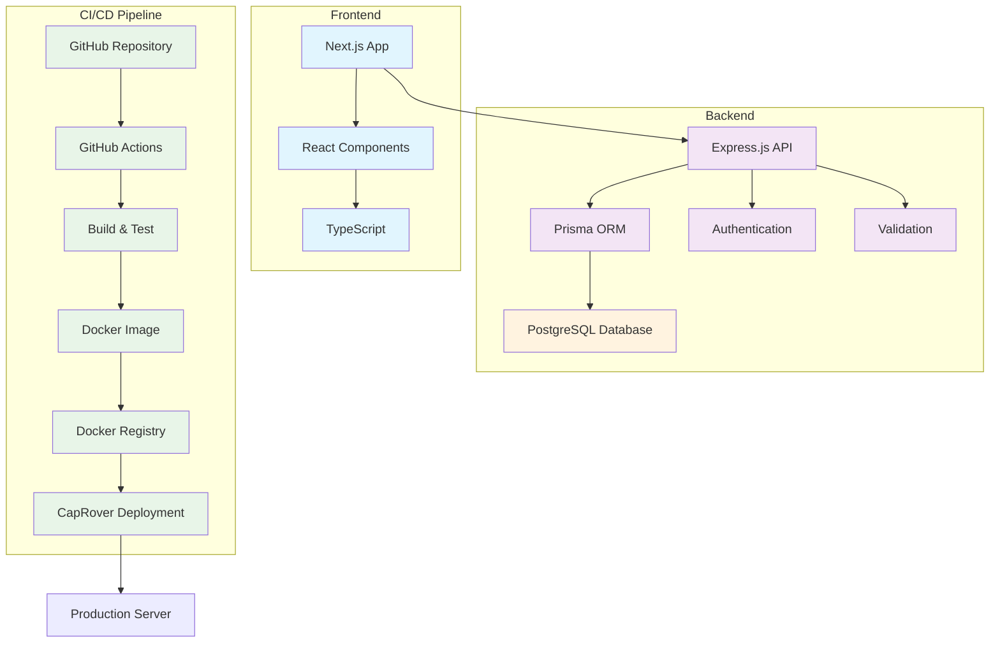

# プロジェクト名

## 概要
<!-- TODO: 詳細を埋める -->

## 技術スタック
- Frontend: Next.js (React + TailwindCSS)
- Backend: Express + Prisma
- DB: PostgreSQL
- Infra: Docker / CapRover / GitHub Actions

## ディレクトリ構成
<!-- TODO: 詳細を埋める -->

## 構成図

Next.js フロントエンド、Express(API)+Prisma、PostgreSQL、CI/CD（GitHub Actions→Docker Registry→CapRover）の構成図。

## 起動方法
- 開発環境の起動手順
<!-- TODO: 詳細を埋める -->
- 必要な依存関係（pnpm / Docker など）
<!-- TODO: 詳細を埋める -->

## デプロイ方法
- CI/CD の流れ（GitHub Actions → CapRover / AWS）
<!-- TODO: 詳細を埋める -->
- イメージタグ運用（latest + sha）
<!-- TODO: 詳細を埋める -->

## プロジェクト基本方針
- [プロジェクトガイドライン](./PROJECT_GUIDELINES.md) を参照

## コーディング規約
- TypeScript strict / ESLint+Prettier
<!-- TODO: 詳細を埋める -->
- Conventional Commits / PR運用
<!-- TODO: 詳細を埋める -->

## テスト
- 単体テスト (Jest/Vitest)
<!-- TODO: 詳細を埋める -->
- E2E テスト (Playwright)
<!-- TODO: 詳細を埋める -->

## セキュリティ
- JWT (HttpOnly Cookie)
<!-- TODO: 詳細を埋める -->
- Dependabot / npm audit
<!-- TODO: 詳細を埋める -->

## ライセンス
- 本プロジェクトはポートフォリオ用途（後に個人制作用）のためUNLICENSED
