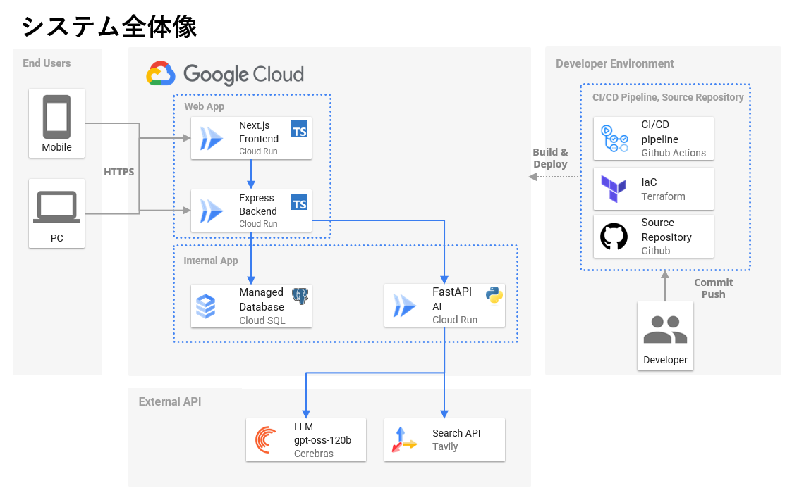
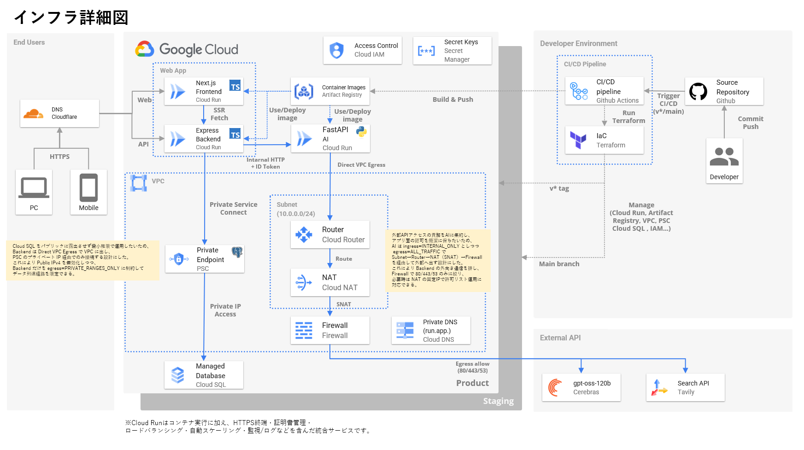

## はじめに

本アプリは、**旅行のしおり（旅程表）をドラッグ＆ドロップで直感的に編集し、A4三つ折り印刷に最適化されたPDFを即座に生成できるWebサービス**です。

**サービスURL**: [https://app.trip.beita.dev/](https://app.trip.beita.dev/)

> **開発環境構築**: [クイックスタートガイド](docs/quick-start.md)を参照してください。

> 詳細な技術ドキュメントはリポジトリ内の各ドキュメントを参照してください。

<p align="center">


</p>

**左**: ドラッグ&ドロップで旅程を編集できるメイン画面。リアルタイムで並べ替え・追加・削除が可能。  
**右**: A4三つ折りに最適化されたPDF出力結果。改ページと折り目が自動調整され、印刷時に崩れない。

- **特徴**
  - 旅程の追加・削除・並べ替えをドラッグ＆ドロップで簡単操作
  - AI（LLM）による旅程自動生成・補完
  - A4三つ折りに最適化されたPDF出力（改ページ・折り目も安定）
  - スマホ・PC両対応、アクセシビリティ配慮

**想定ユーザー**  
- 友人・家族との旅行を計画する幹事役
- 旅行会社や教育機関の引率担当
- 紙のしおりを現地で配布したい方

**開発実績**: 2024年8月〜開発継続中（約2.5ヶ月）、本番環境デプロイ済み (サービスURL: https://app.trip.beita.dev/)

### デモアカウント（全機能体験用）

全機能（AI機能含む）を試す場合は、以下のデモアカウントをご利用ください。

| アカウント名 | メールアドレス | パスワード |
|------------|--------------|----------|
| デモアカウント1 | `beita.dev.services+demo1@gmail.com` | `D@ZlHEreDGZ0` |
| デモアカウント2 | `beita.dev.services+demo2@gmail.com` | `F3BU@yG8jm97` |
| デモアカウント3 | `beita.dev.services+demo3@gmail.com` | `iJrl37d@jJLU` |
| デモアカウント4 | `beita.dev.services+demo4@gmail.com` | `SKsbJ@b40vj/` |

> **注意**: デモアカウントは複数人で共有されるため、データが変更される可能性があります。デモ専用のアカウントです。

## なぜ作ったか（背景と決心）

実際の旅行先では、A4サイズを三つ折りにした紙のしおりが最も使い勝手が良いと思います。
手に取ってすぐ見られ、操作が不要で、通信や電源、端末の故障リスクもありません。
通知に邪魔されることもなく、旅行の雰囲気を壊さずに済みます。

一方で、仲の良い友人同士の旅行では、当日ギリギリまで予定が入れ替わることがよくあります。
集合地点の変更や寄り道の追加、天候不良時の代替案検討、
リアルタイムでの相談など、予定の組み替えが何度も起こるため、しおりの編集・再印刷が必要になります。

しかし、Excelやテキストエディタでは編集に手間がかかり、
現在使用できるWebサービスは簡単な整形出力が主で、
改ページや折り目の調整が不十分です。
準備・再編集には30分〜1時間以上かかり、レイアウトが崩れるとその対処にまた時間がかかってしまいます。

これらの課題を解消するため、ドラッグ＆ドロップ編集と三つ折りに最適な印刷を核に設計しました。
また、旅程が思いつかない場合にはLLMによる自動補完を活用し、対話形式で内容を編集できる機能も用意しています。
これにより、ゼロから考える負担を減らし、ユーザーが直感的に理想の旅程を組み立てられる体験を目指しています。


## ユーザー価値と課題設定


### どんな課題を解くか
- 現地で使う紙のしおりを毎回作り直すのが大変（改ページ/折り目が崩れる、整形に時間がかかる）
- 予定が直前まで変わるのに、Excel/Google Docsでは並べ替えや追記が面倒
- メンバー共有が煩雑（最新版がどれか分からない、コメント履歴が散逸）
- オフライン前提の現地運用で、スマホだけだと見づらい/電池不安

### 提供する価値
- ドラッグ＆ドロップで直感的に並べ替え/追記/削除（編集ストレスを最小化）
- AIによる旅程の自動補完・下書き生成（ゼロ→イチの時間を短縮）
- A4三つ折りに最適化された安定PDF（改ページ/折り目/余白を自動調整）
- URL共有（家族/チームで素早く共有）
- PDF出力・印刷で完全オフライン運用（当日の電波/電池リスクを回避）

### 主要ユースケース
- 旅行前の計画作成（AIでたたきを作成→人が調整）
- 前日/当日の最終調整（並べ替えや差し替えを数分で反映）
- 現地で紙のしおりを配布（A4三つ折りPDFを即印刷）
- 共有リンクで家族/友人に事前共有（閲覧専用/パス保護）

### 非ゴール（当面対応しない範囲）
- 旅行予約・決済機能（外部サービス連携は将来検討）
- 本格ナビ/地図/オフラインマップ提供
- 旅行SNS/レビュー集約プラットフォーム


## 設計判断と技術選定

### アーキテクチャとインフラ設計

モノレポ構成・フロント/バックエンド分離（Next.js〈SSR/SSG+CSR〉＋Express API + Python AI Service）・IaC（Terraform + GCP）・マルチステージビルド。開発効率と本番安定性を両立。

### AI機能のアーキテクチャ

```
Frontend (Next.js)
    ↓ HTTP
Backend (Express/TypeScript)
    ↓ GCP IAM IDトークン認証（本番）/ 内部通信トークン（ローカル）
AI Service (FastAPI/Python)
    ↓
LangChain 0.3 + LangGraph
    ↓
Cerebras API (優先) / OpenAI API (フォールバック)
    ↓
Tavily Search API (RAG機能)
```


**主要な技術選択**:
- **内部通信認証**: GCP IAM IDトークン認証（本番環境）、内部トークン（ローカル環境）
- **RAG実装**: LangGraph ReActエージェント + Tavily検索API
- **LLM**: Cerebras API（優先） / OpenAI API（フォールバック）




### 技術スタック

**フロントエンド**
- Next.js 14 (App Router, SSR/SSG) - サーバーサイドレンダリングと静的生成を活用
- React 18 - Concurrent Features、Server Componentsによるパフォーマンス向上
- Tailwind CSS - 一貫性のあるデザインシステムとテーマ実装

**バックエンド**
- Express - 軽量でパフォーマンスに優れ、ミドルウェアで機能拡張が容易
- TypeScript - 型安全性によるバグの早期発見と開発効率向上
- Prisma - 型安全なORM、自動マイグレーション
- Zod - 型安全なバリデーション（サーバー/フォーム両方）

**AI機能**
- FastAPI - 軽量・高速・型安全なPython APIフレームワーク
- LangChain 0.3 + LangGraph - ReActエージェントによる高度なAI処理
- Cerebras API / OpenAI API - 高速・低コストなLLM推論（フォールバック対応）
- Python 3.11 - RAG実装に適し、実務経験により学習コストが低い

**データベース・インフラ**
- PostgreSQL 16 - ACID保証、JSON型サポート、インデックス最適化
- GCP Cloud Run - サーバーレス、自動スケーリング、コスト効率
- Terraform - IaCによる環境分離とインフラのコード化
- Docker - コンテナ化による環境統一とデプロイ効率化


### 開発体験とツールチェーン

型安全・自動化・一貫性重視。開発者の生産性向上と品質保証を両立。

- **型システム**: TypeScript厳密モード（any警告→エラー化推奨、strict設定）
- **コード品質**: ESLint + Prettier + TSDoc（一貫性、可読性、保守性）
- **API仕様**: OpenAPI 3.1 + Swagger UIによるAPI仕様書の自動生成・管理。エンドポイント追加時に必ず更新し、Swagger UIで確認可能。API設計の品質と一貫性を確保。
- **開発環境**: Docker Compose + ホットリロード（環境統一・高速開発）


## 品質保証（テスト・レビュー・運用）

### テスト戦略と自動化

JestとSupertestを用いた自動化によるユニット/統合/E2Eテストを通じて、継続的品質保証（バグ早期発見と回帰防止）を実現しています。


### コードレビューと品質管理

AI支援・自動化・継続的改善。コード品質向上とナレッジ共有を実現。

- **Firstレビュー**: CodeRabbit（AI自動レビュー・型安全性・セキュリティチェック）
- **手動レビュー**: 人間レビュー（設計判断・ビジネスロジック・可読性）
- **自動チェック**: CodeRabbit内蔵のgitleaks・markdownlint（シークレット・文書品質）


## 再現性と自動化（DX/DevOps）

### 開発環境とCI/CD

環境統一・自動化・継続的デリバリー。開発効率とデプロイ品質を両立。

- **開発環境**: Docker Compose + ホットリロード
- **CI/CD**: GitHub Actions + Makefile
- **インフラ**: Terraform + GCP Cloud Run

## パフォーマンスとUX

### パフォーマンス最適化

高速レスポンス・効率的なリソース利用・ユーザー体験向上。AI機能とUIの両方で最適化を実現。

- **AI機能最適化**: 
  - **LLMプロバイダー選択**: Cerebras優先（gpt-oss-120b、高速・低コスト）
  - **RAG機能**: Tavily検索APIによる最新情報取得（回数制限: 3回/実行）
  - **リトライ機能**: LLM APIのレート制限対応
  - **内部通信**: FastAPI + LangChain 0.3 + LangGraphによる効率的なAI処理
- **フロントエンド最適化**: Next.js SSR/SSG・画像最適化・コード分割
- **API最適化**: レスポンス時間・データ量削減・並列処理
- **監視**: 使用量追跡・パフォーマンスメトリクス・エラー監視


### アクセシビリティとUX

誰でも使いやすい・直感的な操作・一貫性のあるデザイン。ユーザビリティとアクセシビリティを両立。

- **アクセシビリティ**: @dnd-kit・キーボード操作・スクリーンリーダー対応
- **UX設計**: ドラッグ&ドロップ・ローディング状態・エラーハンドリング
- **デザインシステム**: Tailwind CSS・一貫性のあるコンポーネント・レスポンシブ
- **テーマ一貫性**: `frontend/src/app/globals.css` によるカラートークン/レイヤ管理（Light/Dark対応）
- **ユーザビリティ**: 直感的な操作・フィードバック・プログレス表示

## セキュリティとデータ設計

- **認証**: JWT（Access/Refresh Token、60分/30日）、HttpOnly Cookieで送信
- **入力検証**: Zodによるサーバー/フォーム両方での厳格なバリデーション
- **内部通信認証**: GCP IAM IDトークン認証（本番環境）
- **APIキー管理**: GCP Secret Managerによる安全な管理
- **レート制限**: API呼び出し頻度の制限（Tavily: 3回/実行、LLM: 60秒タイムアウト）
- **入力サニタイズ**: HTML/URL除去、長さ制限、制御文字除去
- **ネットワーク制御**: AIサービスはVPC内部からのみアクセス可能
- **データベース設計**: PostgreSQL 16を使用。ER図・テーブル仕様・制約/インデックスの詳細は[データベーススキーマ](docs/database-schema.md)を参照してください。