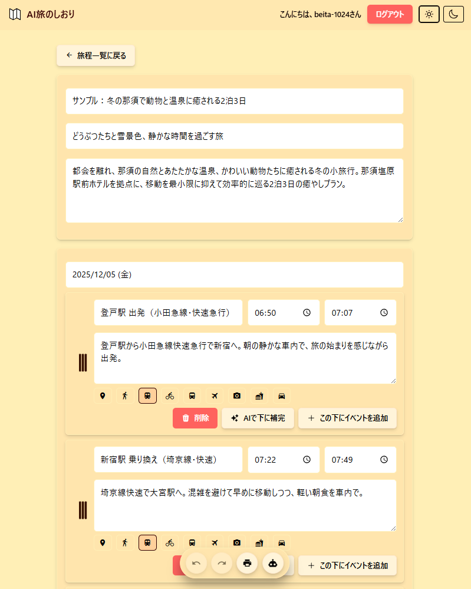
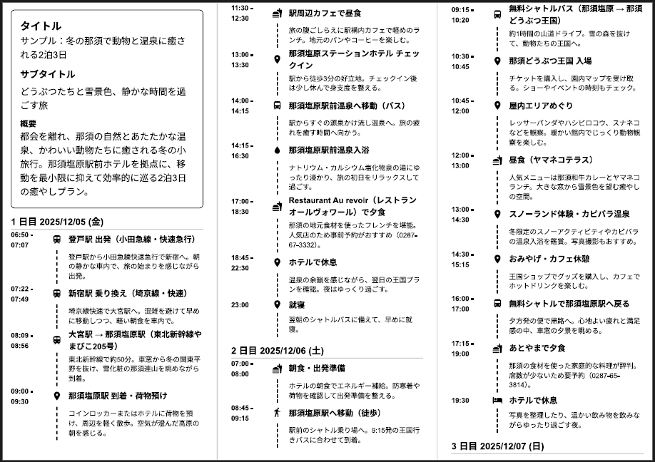
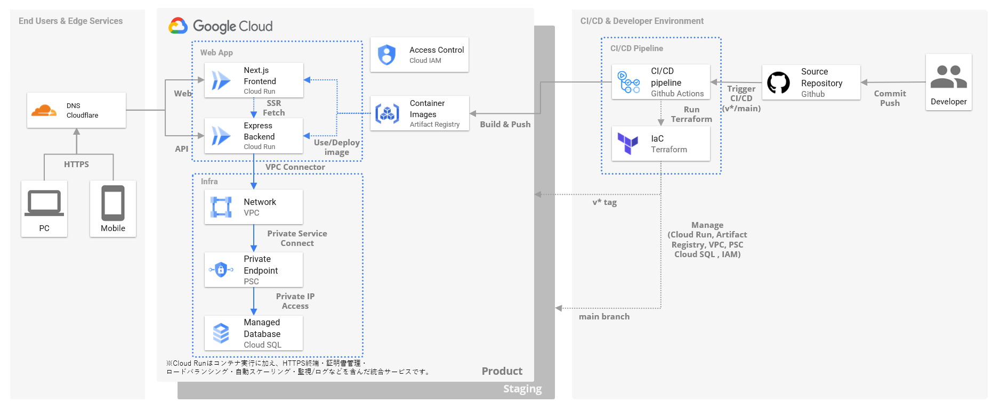

  
  

## はじめに

本アプリは、**旅行のしおり（旅程表）をドラッグ＆ドロップで直感的に編集し、A4三つ折り印刷に最適化されたPDFを即座に生成できるWebサービス**です。  
「現地で紙のしおりを使いたい」「予定の並べ替えや追加・削除を柔軟に行いたい」「AIで旅程を自動補完したい」といったニーズに応え、**編集のしやすさ・印刷の美しさ・アクセシビリティ**を重視して設計しています。

- **特徴**
  - 旅程の追加・削除・並べ替えをドラッグ＆ドロップで簡単操作
  - AI（GPT-4o mini）による旅程自動生成・補完
  - A4三つ折りに最適化されたPDF出力（改ページ・折り目も安定）
  - スマホ・PC両対応、アクセシビリティ配慮
  - チーム/家族での共同編集やコメント機能（予定）

**想定ユーザー**  
- 友人・家族との旅行を計画する幹事役
- 旅行会社や教育機関の引率担当
- 紙のしおりを現地で配布したい方

## なぜ作ったか（背景と決心）

気心の知れた友人との旅行では、当日直前まで予定が変わることが多いです。
集合場所の変更や立ち寄り先の追加、雨天時の代替案、通話しながらの調整などで、予定の並べ替えが頻繁に発生します。
一方、現地での運用にはA4三つ折りの紙のしおりが最も実用的です。
取り出してすぐに確認でき（操作不要）、電波や電池、端末の故障の影響を受けず、通知に気を散らされず没入を壊さない体験を維持できます。しかし、Excelやテキストでは手戻りが多く、既存のWebサービスは簡易的な整形印刷が中心で、改ページや折り目が安定しません。準備・再編集には30分~1時間以上かかり、レイアウトが崩れるとその対処にまた時間がかかります。これらの課題を解消するため、ドラッグ＆ドロップ編集と三つ折りに最適な印刷を核に設計いたしました。
また、旅程が思いつかない場合にはLLMによる自動補完を活用し、対話形式で候補を提案・編集できる機能も備えています。これにより、ゼロから考える負担を減らし、ユーザーが直感的に理想の旅程を組み立てられる体験を目指しました。

## ユーザー価値と課題設定

### どんな課題を解くか
- 現地で使う紙のしおりを毎回作り直すのが大変（改ページ/折り目が崩れる、整形に時間がかかる）
- 予定が直前まで変わるのに、Excel/Google Docsでは並べ替えや追記が面倒
- メンバー共有が煩雑（最新版がどれか分からない、コメント履歴が散逸）
- オフライン前提の現地運用で、スマホだけだと見づらい/電池不安

### 提供する価値
- ドラッグ＆ドロップで直感的に並べ替え/追記/削除（編集ストレスを最小化）
- AIによる旅程の自動補完・下書き生成（ゼロ→イチの時間を短縮）
- A4三つ折りに最適化された安定PDF（改ページ/折り目/余白を自動調整）
- URL共有（家族/チームで素早く共有）
- PDF出力・印刷で完全オフライン運用（当日の電波/電池リスクを回避）

### 主要ユースケース
- 旅行前の計画作成（AIでたたきを作成→人が調整）
- 前日/当日の最終調整（並べ替えや差し替えを数分で反映）
- 現地で紙のしおりを配布（A4三つ折りPDFを即印刷）
- 共有リンクで家族/友人に事前共有（閲覧専用/パス保護）

### 非ゴール（当面対応しない範囲）
- 旅行予約・決済機能（外部サービス連携は将来検討）
- 本格ナビ/地図/オフラインマップ提供
- 旅行SNS/レビュー集約プラットフォーム

## 設計判断と技術選定

### アーキテクチャとインフラ設計

モノレポ構成・フロント/バックエンド分離（Next.js〈SSR/SSG+CSR〉＋Express API）・IaC・マルチステージビルド。開発効率と本番安定性を両立。

- **フロントエンド**:
  - Next.js 15: App Router・SSR/SSG・型安全なフルスタック開発で採用
  - React 19: 最新のConcurrent Features・Server Componentsで採用
  - Tailwind CSS: ユーティリティファースト・一貫性のあるデザインシステムで採用
  - @dnd-kit: ドラッグ&ドロップ機能・アクセシビリティ対応で採用
  - @heroicons/react: 一貫性のあるアイコンセット・Tree Shaking対応で採用
  - react-hook-form: パフォーマンス・バリデーション・型安全なフォーム管理で採用
- **バックエンド**:
  - Express: 軽量・高速・ミドルウェア豊富なNode.jsフレームワークで採用
  - TypeScript: 型安全・開発効率・保守性向上で採用
  - Prisma: 型安全ORM・マイグレーション・クエリビルダーで採用
  - Zod: 型安全バリデーション・スキーマ定義・実行時型チェックで採用
  - jsonwebtoken: JWT認証・トークン管理・セキュリティで採用
  - argon2: パスワードハッシュ化・セキュリティ・耐量子攻撃で採用
  - helmet: セキュリティヘッダー・XSS/CSRF対策で採用
  - nodemailer: メール送信・認証・通知機能で採用
- **データベース**:
  - PostgreSQL 16: ACID保証・JSON型サポート・インデックス最適化で採用
- **インフラ**:
  - GCP Cloud Run: サーバーレス・自動スケーリング・コスト効率で採用
  - Terraform: IaC・環境分離・インフラのコード化で採用
  - Docker: コンテナ化・環境統一・デプロイ効率化で採用

**参照**
- `/terraform/README.md`: IaCの構成と適用手順（環境分離・デプロイ）

### 開発体験とツールチェーン

型安全・自動化・一貫性重視。開発者の生産性向上と品質保証を両立。

- **型システム**: TypeScript厳密モード（any警告→エラー化推奨、strict設定）
- **コード品質**: ESLint + Prettier + TSDoc（一貫性、可読性、保守性）
- **API仕様**: OpenAPI 3.1 + Swagger UI（仕様書・テスト・ドキュメント）
- **開発環境**: Docker Compose + ホットリロード（環境統一・高速開発）

**参照**
- `/PROJECT_GUIDELINES.md`: ブランチ/PR/コミット規約と基本方針

## 品質保証（テスト・レビュー・運用）

### テスト戦略と自動化

多層防御・自動化・継続的品質保証。バグ早期発見と回帰防止を実現。

- **テスト**: Jest + Supertest（ユニット・統合・E2E）
- **コードカバレッジ**: 閾値設定・品質ゲート・継続的監視
- **APIテスト**: OpenAPI仕様書ベース・契約テスト・モック活用
- **テストデータ**: シード・モック・フィクスチャ（再現性・一貫性）

**参照**
- `/docs/api/openapi.yaml`: OpenAPI仕様書

### コードレビューと品質管理

AI支援・自動化・継続的改善。コード品質向上とナレッジ共有を実現。

- **Firstレビュー**: CodeRabbit（AI自動レビュー・型安全性・セキュリティチェック）
- **手動レビュー**: 人間レビュー（設計判断・ビジネスロジック・可読性）
- **自動チェック**: gitleaks・markdownlint・languagetool（シークレット・文書品質）
- **レビュー文化**: 丁寧でフレンドリー・事実ベース・一次情報参照

**参照**
- `/PROJECT_GUIDELINES.md`: PR運用/レビュー方針・ライフサイクル
- `/.coderabbit.yaml`: CodeRabbitレビュー設定（強度/指摘方針/自動化）

## 再現性と自動化（DX/DevOps）

### 開発環境とCI/CD

環境統一・自動化・継続的デリバリー。開発効率とデプロイ品質を両立。

- **開発環境**: Docker Compose + ホットリロード（環境統一・高速開発）
- **CI/CD**: GitHub Actions + Makefile（自動テスト・デプロイ・品質ゲート）
- **インフラ**: Terraform + GCP Cloud Run（IaC・環境分離・自動スケーリング）
- **監視**: ログ・メトリクス・アラート（運用可視性・障害早期発見）

**参照**
- `/terraform/README.md`: Terraform構成・環境変数・apply手順

## パフォーマンスとA11y/UX

### パフォーマンス最適化

高速レスポンス・効率的なリソース利用・ユーザー体験向上。AI機能とUIの両方で最適化を実現。

- **AI機能最適化**: モデル選択・キャッシュ戦略・リトライ機能（GPT-4o Mini推奨）
- **フロントエンド最適化**: Next.js SSR/SSG・画像最適化・コード分割
- **API最適化**: レスポンス時間・データ量削減・並列処理
- **監視**: 使用量追跡・パフォーマンスメトリクス・エラー監視

### アクセシビリティとUX

誰でも使いやすい・直感的な操作・一貫性のあるデザイン。ユーザビリティとアクセシビリティを両立。

- **アクセシビリティ**: @dnd-kit・キーボード操作・スクリーンリーダー対応
- **UX設計**: ドラッグ&ドロップ・ローディング状態・エラーハンドリング
- **デザインシステム**: Tailwind CSS・一貫性のあるコンポーネント・レスポンシブ
- **テーマ一貫性**: `frontend/src/app/globals.css` によるカラートークン/レイヤ管理（Light/Dark対応）
- **ユーザビリティ**: 直感的な操作・フィードバック・プログレス表示

**参照**
- `/docs/ux/design/`: デザインアセット

## セキュリティとデータ設計

最小権限・境界での入力検証・短命トークン。PoCは自作JWT、本番は jose/IdP へ移行前提。

- **Authフロー**: Access/Refresh JWT（15分/7日）、パスワード変更時のトークン無効化、Cookie-based認証
- **zod/DTOで入力検証**: サーバ/フォーム両方で厳格なバリデーション（パスワード強度、旅程ID形式等）
- **Prismaスキーマ**: FK/Unique/監査列（createdAt/updatedAt）、カスケード削除、インデックス最適化

**参照**
- `/docs/database-schema.md`: ER図・テーブル仕様・制約/インデックス

## ドキュメント一覧

プロジェクトの主要ドキュメントへのリンク一覧です（ディレクトリ別）。

- ルート
  - [README.md](README.md) - プロダクト概要・設計判断・参照リンクの総合ガイド
  - [PROJECT_GUIDELINES.md](PROJECT_GUIDELINES.md) - ブランチ運用/PR/レビュー/コミット規約
  - [terraform/README.md](terraform/README.md) - IaC構成・環境変数・適用手順

- docs（トップ）
  - [docs/quick-start.md](docs/quick-start.md) - クイックスタート（環境変数設定含む）
  - [docs/database-schema.md](docs/database-schema.md) - ER図・テーブル仕様・制約/インデックス

- docs/api
  - [docs/api/openapi.yaml](docs/api/openapi.yaml) - OpenAPI仕様書

- docs/deployment
  - [docs/deployment/domain-mapping-guide.md](docs/deployment/domain-mapping-guide.md) - ドメインマッピング設定
  - [docs/deployment/emoji-usage-policy.md](docs/deployment/emoji-usage-policy.md) - 絵文字の利用方針/コミット運用
  - [docs/deployment/github-actions-setup.md](docs/deployment/github-actions-setup.md) - Actionsワークフロー構築手順

- docs/ux
  - [docs/ux/design/](docs/ux/design/) - デザインアセット