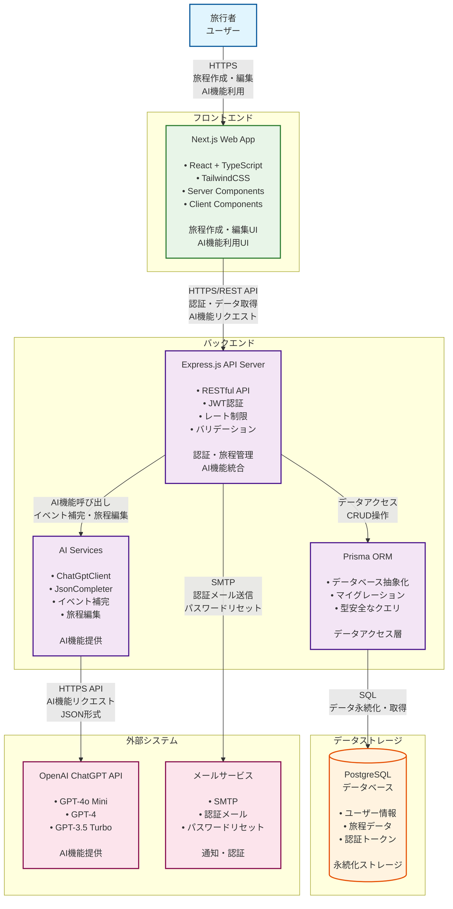

# コンテナ図

## 概要

Trip Shioriのコンテナ図（C4 Level 2）です。システム内部の各コンテナの役割と相互関係、技術スタック、通信プロトコルを示しています。

## コンテナ図

## 主要なコンテナ構成

### フロントエンド
- **Next.js Web App**: React + TypeScript + TailwindCSS
  - Server Components / Client Components
  - 旅程作成・編集UI、AI機能利用UI

### バックエンド
- **Express.js API Server**: RESTful API、JWT認証、レート制限、バリデーション
- **Prisma ORM**: データベース抽象化、マイグレーション、型安全なクエリ
- **AI Services**: ChatGptClient、JsonCompleter、イベント補完・旅程編集機能

### データストレージ
- **PostgreSQL**: ユーザー情報、旅程データ、認証トークンの永続化

### 外部システム
- **OpenAI ChatGPT API**: GPT-4o Mini、GPT-4、GPT-3.5 TurboによるAI機能提供
- **メールサービス**: SMTP、認証メール、パスワードリセット

## 主要な通信関係

- **ユーザー ↔ フロントエンド**: HTTPS経由で旅程作成・編集、AI機能利用
- **フロントエンド ↔ バックエンド**: HTTPS/REST API経由で認証・データ取得、AI機能リクエスト
- **バックエンド内部**: API → Prisma（データアクセス）、API → AI Services（AI機能呼び出し）
- **データアクセス**: Prisma → PostgreSQL（SQL経由でデータ永続化・取得）
- **外部連携**: AI Services → OpenAI（HTTPS API）、API → メールサービス（SMTP）

## 技術スタック

### フロントエンド
- **Next.js**: React フレームワーク
- **TypeScript**: 型安全な開発
- **TailwindCSS**: スタイリング
- **Server Components**: サーバーサイドレンダリング
- **Client Components**: クライアントサイドインタラクション

### バックエンド
- **Express.js**: Node.js Webフレームワーク
- **Prisma**: データベースORM
- **JWT**: 認証トークン
- **OpenAI API**: AI機能統合

### データベース
- **PostgreSQL**: リレーショナルデータベース
- **Prisma Migrate**: データベースマイグレーション

### 外部サービス
- **OpenAI ChatGPT API**: AI機能提供
- **SMTP**: メール送信
