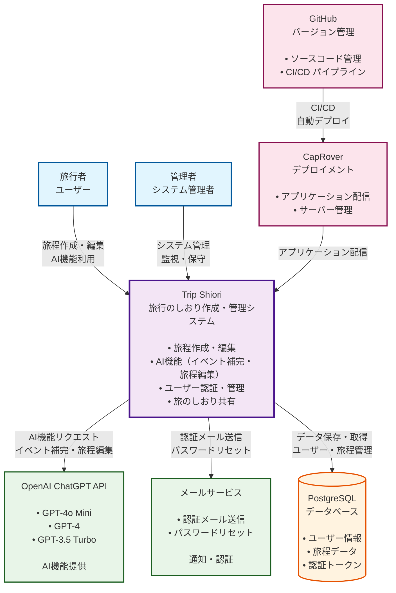

# システムコンテキスト図

## 概要

Trip Shioriのシステムコンテキスト図（C4 Level 1）です。システムの全体像と外部システムとの関係性を示しています。

## システムコンテキスト図

## 主要な構成要素

### ユーザー（アクター）
- **旅行者ユーザー**: 旅程作成・編集、AI機能利用
- **管理者**: システム管理、監視・保守

### メインシステム
- **Trip Shiori**: 旅行のしおり作成・管理システム
  - 旅程作成・編集
  - AI機能（イベント補完・旅程編集）
  - ユーザー認証・管理
  - 旅のしおり共有

### 外部システム
- **OpenAI ChatGPT API**: AI機能提供（GPT-4o Mini、GPT-4、GPT-3.5 Turbo）
- **メールサービス**: 認証メール送信、パスワードリセット

### データストレージ
- **PostgreSQL**: ユーザー情報、旅程データ、認証トークン

### インフラ・デプロイ
- **CapRover**: アプリケーション配信、サーバー管理
- **GitHub**: ソースコード管理、CI/CDパイプライン

## 主要な関係性

- ユーザーがTrip Shioriシステムを利用して旅程を作成・編集
- Trip ShioriがOpenAI APIを利用してAI機能を提供
- メールサービスとの連携でユーザー認証を実現
- PostgreSQLでデータを永続化
- GitHub Actions → CapRover のCI/CDパイプラインで自動デプロイ
