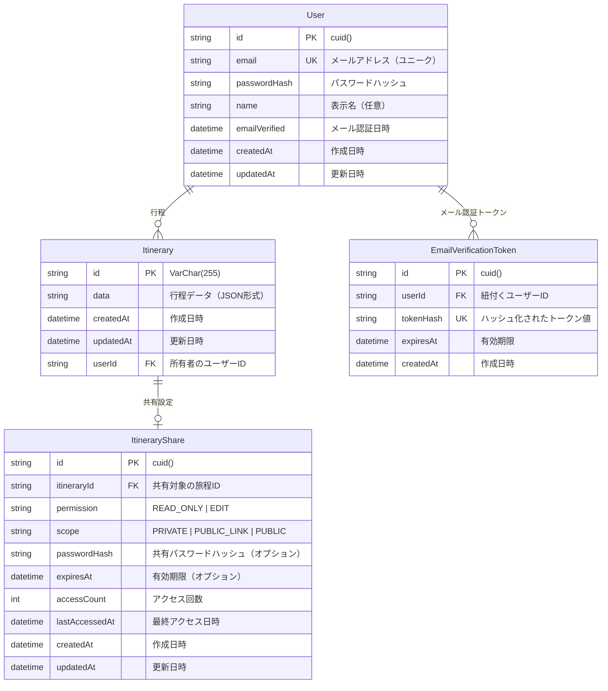

# Trip Shiori データベーススキーマ

## ER図

## テーブル詳細

### User（ユーザー）
- **目的**: ユーザー情報を管理
- **主キー**: `id` (cuid)
- **ユニーク制約**: `email`
- **リレーション**: 
  - 1対多: `Itinerary` (ユーザーが所有する行程)
  - 1対多: `EmailVerificationToken` (メール認証トークン)

### Itinerary（行程）
- **目的**: 旅行の行程データを管理
- **主キー**: `id` (VarChar(255))（旅程のURLと対応させるためにあえてここだけVarCharにしている。10文字のID）
- **外部キー**: `userId` → `User.id`
- **リレーション**: 
  - 多対1: `User` (所有者)
  - 1対0または1: `ItineraryShare` (共有設定)
- **特徴**: 
  - 行程データはJSON形式で保存（LLM APIとの互換性のため）
  - ユーザー削除時はカスケード削除（親が消えたら消す設定）

### EmailVerificationToken（メール認証トークン）
- **目的**: メール認証用のトークンを管理
- **主キー**: `id` (cuid)
- **外部キー**: `userId` → `User.id`
- **ユニーク制約**: `tokenHash`
- **インデックス**: 
  - `userId` (検索性能向上)
  - `expiresAt` (期限切れトークン削除用)
  - `tokenHash` (トークン検索用)
- **特徴**: ユーザー削除時はカスケード削除

### ItineraryShare（旅程共有設定）
- **目的**: 旅程の共有設定とアクセス統計を管理
- **主キー**: `id` (cuid)
- **外部キー**: `itineraryId` → `Itinerary.id`
- **リレーション**: 
  - 多対1: `Itinerary` (共有対象の旅程)
- **特徴**: 
  - 共有権限: `READ_ONLY`（閲覧のみ）または `EDIT`（編集可能）
  - 公開範囲: `PRIVATE`（プライベート）、`PUBLIC_LINK`（リンク共有）、`PUBLIC`（全体公開）
  - パスワード保護: オプションで共有パスワードを設定可能
  - 有効期限: オプションで共有の有効期限を設定可能
  - アクセス統計: アクセス回数と最終アクセス日時を記録
  - 旅程削除時はカスケード削除

## インデックス

| テーブル | カラム | 目的 |
|---------|--------|------|
| EmailVerificationToken | userId | ユーザー別トークン検索 |
| EmailVerificationToken | expiresAt | 期限切れトークン削除 |
| EmailVerificationToken | tokenHash | トークン検索 |
| ItineraryShare | itineraryId | 旅程別共有設定検索 |
| ItineraryShare | scope | 公開範囲別検索 |
| ItineraryShare | expiresAt | 期限切れ共有設定削除 |

## セキュリティ考慮事項

1. **パスワード**: Argon2でハッシュ化
2. **認証トークン**: ハッシュ化して保存
3. **共有パスワード**: Argon2でハッシュ化
4. **カスケード削除**: ユーザー削除時に関連データも削除
5. **有効期限**: 認証トークンと共有設定に有効期限を設定
6. **アクセス制御**: 共有設定に基づく適切なアクセス制御

## データベース設定

- **プロバイダー**: PostgreSQL
- **接続**: `DATABASE_URL`環境変数で設定
- **タイムゾーン**: Timestamptz(6)でタイムゾーン対応
