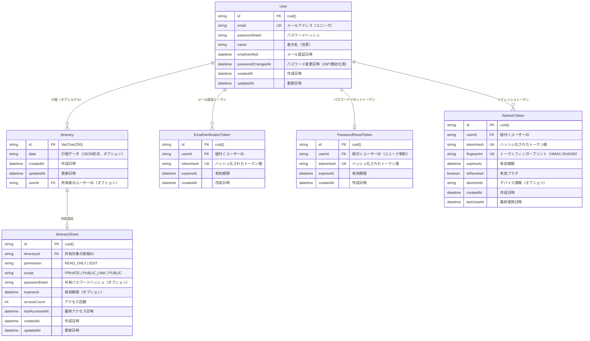

# Trip Shiori データベーススキーマ

## ER図

## テーブル詳細

### User（ユーザー）
- **目的**: ユーザー情報を管理
- **主キー**: `id` (cuid)
- **ユニーク制約**: `email`
- **リレーション**: 
  - 1対多: `Itinerary` (ユーザーが所有する行程)
  - 1対多: `EmailVerificationToken` (メール認証トークン)
  - 1対0または1: `PasswordResetToken` (パスワードリセットトークン)
  - 1対多: `RefreshToken` (リフレッシュトークン)
- **特徴**: 
  - パスワード変更日時（`passwordChangedAt`）でJWT無効化を実現
  - メール認証状態を管理（`emailVerified`）

### Itinerary（行程）
- **目的**: 旅行の行程データを管理
- **主キー**: `id` (VarChar(255))（旅程のURLと対応させるためにあえてここだけVarCharにしている。10文字のID）
- **外部キー**: `userId` → `User.id` (オプショナル)
- **リレーション**: 
  - 多対0または1: `User` (所有者、認証機能実装前はオプショナル)
  - 1対0または1: `ItineraryShare` (共有設定)
- **特徴**: 
  - 行程データはJSON形式で保存（LLM APIとの互換性のため）
  - `data`フィールドはオプショナル（初期状態ではnullの可能性）
  - `userId`はオプショナル（認証機能実装前の暫定仕様、TODO: 認証機能実装後に必須化）
  - ユーザー削除時はカスケード削除（親が消えたら消す設定）

### EmailVerificationToken（メール認証トークン）
- **目的**: メール認証用のトークンを管理
- **主キー**: `id` (cuid)
- **外部キー**: `userId` → `User.id`
- **ユニーク制約**: `tokenHash`
- **インデックス**: 
  - `userId` (検索性能向上)
  - `expiresAt` (期限切れトークン削除用)
  - `tokenHash` (トークン検索用)
- **特徴**: ユーザー削除時はカスケード削除

### PasswordResetToken（パスワードリセットトークン）
- **目的**: パスワードリセット用のトークンを管理
- **主キー**: `id` (cuid)
- **外部キー**: `userId` → `User.id`
- **ユニーク制約**: 
  - `userId` (1ユーザー1トークンの制約)
  - `tokenHash` (トークン値のユニーク性)
- **インデックス**: 
  - `expiresAt` (期限切れトークン削除用)
  - `tokenHash` (トークン検索用)
  - `userId, expiresAt, createdAt` (複合インデックス、検索最適化用)
- **特徴**: 
  - ユーザー削除時はカスケード削除
  - 1ユーザーにつき1トークンのみ（競合状態防止）

### RefreshToken（リフレッシュトークン）
- **目的**: 認証用のリフレッシュトークンを管理
- **主キー**: `id` (cuid)
- **外部キー**: `userId` → `User.id`
- **ユニーク制約**: 
  - `tokenHash` (トークン値のユニーク性)
  - `fingerprint` (トークンフィンガープリントのユニーク性)
- **インデックス**: 
  - `userId` (ユーザー別トークン検索)
  - `expiresAt` (期限切れトークン削除用)
  - `isRevoked` (失効トークン検索用)
  - `userId, isRevoked, expiresAt` (複合インデックス、有効トークン検索用)
- **特徴**: 
  - ユーザー削除時はカスケード削除
  - Refresh Token Rotation対応（`isRevoked`フラグで失効管理）
  - デバイス情報を記録（セキュリティ監視用）
  - フィンガープリントでDB検索を最適化

### ItineraryShare（旅程共有設定）
- **目的**: 旅程の共有設定とアクセス統計を管理
- **主キー**: `id` (cuid)
- **外部キー**: `itineraryId` → `Itinerary.id`
- **リレーション**: 
  - 多対1: `Itinerary` (共有対象の旅程)
- **特徴**: 
  - 共有権限: `READ_ONLY`（閲覧のみ）または `EDIT`（編集可能）
  - 公開範囲: `PRIVATE`（プライベート）、`PUBLIC_LINK`（リンク共有）、`PUBLIC`（全体公開）
  - パスワード保護: オプションで共有パスワードを設定可能
  - 有効期限: オプションで共有の有効期限を設定可能
  - アクセス統計: アクセス回数と最終アクセス日時を記録
  - 旅程削除時はカスケード削除
- **注意**: `PUBLIC`（全体公開）機能は仕様調整のため一時的に無効化されています（`PUBLIC_SHARING_ENABLED`環境変数で制御）

## インデックス

| テーブル | カラム | 目的 |
|---------|--------|------|
| Itinerary | userId, updatedAt | ユーザー別の更新日時順検索 |
| Itinerary | userId, createdAt | ユーザー別の作成日時順検索 |
| Itinerary | updatedAt | 所有者なし旅程の更新日時順検索 |
| Itinerary | createdAt | 所有者なし旅程の作成日時順検索 |
| EmailVerificationToken | userId | ユーザー別トークン検索 |
| EmailVerificationToken | expiresAt | 期限切れトークン削除 |
| EmailVerificationToken | tokenHash | トークン検索 |
| PasswordResetToken | expiresAt | 期限切れトークン削除 |
| PasswordResetToken | tokenHash | トークン検索 |
| PasswordResetToken | userId, expiresAt, createdAt | 検索最適化（最新・未失効の取得） |
| RefreshToken | userId | ユーザー別トークン検索 |
| RefreshToken | expiresAt | 期限切れトークン削除 |
| RefreshToken | isRevoked | 失効トークン検索 |
| RefreshToken | userId, isRevoked, expiresAt | 有効トークン検索最適化 |
| ItineraryShare | itineraryId | 旅程別共有設定検索（ユニーク） |
| ItineraryShare | scope | 公開範囲別検索 |
| ItineraryShare | expiresAt | 期限切れ共有設定削除 |

## セキュリティ考慮事項

1. **パスワード**: Argon2でハッシュ化
2. **認証トークン**: ハッシュ化して保存
3. **共有パスワード**: Argon2でハッシュ化
4. **カスケード削除**: ユーザー削除時に関連データも削除
5. **有効期限**: 認証トークンと共有設定に有効期限を設定
6. **アクセス制御**: 共有設定に基づく適切なアクセス制御
7. **パスワード変更検知**: `passwordChangedAt`でJWT無効化を実現
8. **Refresh Token Rotation**: `isRevoked`フラグで使用済みトークンを即座に失効
9. **トークンフィンガープリント**: RefreshTokenの`fingerprint`でDB検索を最適化
10. **デバイス情報記録**: RefreshTokenの`deviceInfo`でセキュリティ監視

## データベース設定

- **プロバイダー**: PostgreSQL
- **接続**: `DATABASE_URL`環境変数で設定
- **タイムゾーン**: Timestamptz(6)でタイムゾーン対応
